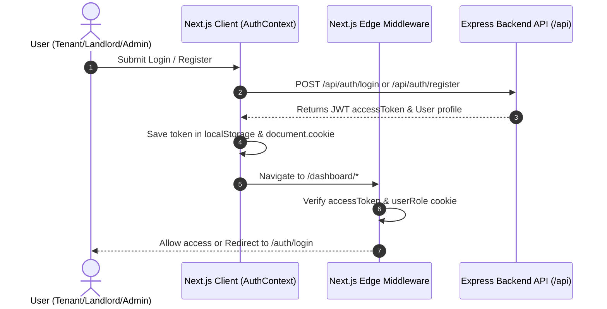

# 🔗 RentNest API Integration & Consumption Guide

This document details how the **RentNest Frontend Client** (Next.js 16 App Router) integrates with and consumes the **RentNest RESTful API Server**.

---

## 🛠️ API Client Architecture & Request Flow

The frontend consumes backend REST endpoints using a centralized `fetchApi` wrapper located in [`src/lib/api.ts`](file:///d:/Rentnest/frontend/src/lib/api.ts).

### Key Features of `fetchApi`:
1. **Base URL Resolution**: Defaults to `http://localhost:7000/api` or reads from `NEXT_PUBLIC_API_URL` environment variable.
2. **Token Injection**: Automatically attaches JWT bearer tokens from `localStorage` (`rentnest_token`) to the `Authorization` request header.
3. **Cookie Synchronization**: Sends HTTP cookies (`credentials: "include"`) for Next.js Edge Middleware synchronization (`accessToken`, `userRole`).
4. **Standardized Response Structure**: Enforces type safety matching backend response schemas:

```typescript
export interface ApiResponse<T = any> {
  success: boolean;
  statusCode: number;
  message: string;
  data?: T;
  meta?: {
    page: number;
    limit: number;
    total: number;
  };
  errorSources?: any;
}
```

---

## 🔐 Auth & Role-Based Flow



---

## 📑 Complete API Consumption Matrix

Below is the complete mapping of backend REST endpoints consumed by Next.js App Router pages and components.

### 🔑 1. Authentication Module (`/api/auth`)

| Backend Endpoint | HTTP Method | Auth Required | Consuming Frontend File | Description |
| :--- | :---: | :---: | :--- | :--- |
| `/api/auth/register` | `POST` | Public | [`src/app/auth/register/page.tsx`](file:///d:/Rentnest/frontend/src/app/auth/register/page.tsx) | Registers new Tenant or Landlord user |
| `/api/auth/login` | `POST` | Public | [`src/app/auth/login/page.tsx`](file:///d:/Rentnest/frontend/src/app/auth/login/page.tsx) | Authenticates user & sets session cookies |
| `/api/auth/me` | `GET` | Bearer Token | [`src/context/AuthContext.tsx`](file:///d:/Rentnest/frontend/src/context/AuthContext.tsx) | Fetches authenticated user profile details |

---

### 🏘️ 2. Properties Marketplace Module (`/api/properties`)

| Backend Endpoint | HTTP Method | Auth Required | Consuming Frontend File | Description |
| :--- | :---: | :---: | :--- | :--- |
| `/api/properties` | `GET` | Public | [`src/app/properties/page.tsx`](file:///d:/Rentnest/frontend/src/app/properties/page.tsx) | Searches & filters listings with `page`, `limit`, `searchTerm`, `location`, `type`, `minPrice`, `maxPrice` |
| `/api/properties/:id` | `GET` | Public | [`src/app/properties/[id]/page.tsx`](file:///d:/Rentnest/frontend/src/app/properties/[id]/page.tsx) | Fetches single property details, landlord info, and reviews |

---

### 🏷️ 3. Categories Module (`/api/categories`)

| Backend Endpoint | HTTP Method | Auth Required | Consuming Frontend File | Description |
| :--- | :---: | :---: | :--- | :--- |
| `/api/categories` | `GET` | Public | [`src/app/properties/page.tsx`](file:///d:/Rentnest/frontend/src/app/properties/page.tsx), [`src/app/page.tsx`](file:///d:/Rentnest/frontend/src/app/page.tsx) | Fetches all property categories for search sidebar & homepage |

---

### 📄 4. Tenant Rental Requests Module (`/api/rentals`)

| Backend Endpoint | HTTP Method | Auth Required | Consuming Frontend File | Description |
| :--- | :---: | :---: | :--- | :--- |
| `/api/rentals` | `POST` | Tenant | [`src/app/properties/[id]/page.tsx`](file:///d:/Rentnest/frontend/src/app/properties/[id]/page.tsx) | Submits rental application with move-in date & duration |
| `/api/rentals` | `GET` | Tenant | [`src/app/dashboard/tenant/page.tsx`](file:///d:/Rentnest/frontend/src/app/dashboard/tenant/page.tsx) | Fetches tenant's rental application history & status badges |
| `/api/rentals/:id` | `GET` | Tenant | [`src/app/dashboard/tenant/requests/[id]/pay/page.tsx`](file:///d:/Rentnest/frontend/src/app/dashboard/tenant/requests/[id]/pay/page.tsx) | Fetches approved rental details before payment checkout |

---

### 🏡 5. Landlord Management Module (`/api/landlord/properties`)

| Backend Endpoint | HTTP Method | Auth Required | Consuming Frontend File | Description |
| :--- | :---: | :---: | :--- | :--- |
| `/api/landlord/properties` | `GET` | Landlord | [`src/app/dashboard/landlord/page.tsx`](file:///d:/Rentnest/frontend/src/app/dashboard/landlord/page.tsx) | Fetches listings owned by the logged-in landlord |
| `/api/landlord/properties` | `POST` | Landlord | [`src/app/dashboard/landlord/properties/new/page.tsx`](file:///d:/Rentnest/frontend/src/app/dashboard/landlord/properties/new/page.tsx) | Creates a new property listing |
| `/api/landlord/properties/:id` | `PUT` / `DELETE` | Landlord | [`src/app/dashboard/landlord/page.tsx`](file:///d:/Rentnest/frontend/src/app/dashboard/landlord/page.tsx) | Updates or deletes landlord's property listing |
| `/api/landlord/properties/requests` | `GET` | Landlord | [`src/app/dashboard/landlord/requests/page.tsx`](file:///d:/Rentnest/frontend/src/app/dashboard/landlord/requests/page.tsx) | Fetches incoming tenant applications for landlord's properties |
| `/api/landlord/properties/requests/:id` | `PATCH` | Landlord | [`src/app/dashboard/landlord/requests/page.tsx`](file:///d:/Rentnest/frontend/src/app/dashboard/landlord/requests/page.tsx) | Approves or rejects incoming tenant rental applications |

---

### 💳 6. Payments & Stripe Checkout Module (`/api/payments`)

| Backend Endpoint | HTTP Method | Auth Required | Consuming Frontend File | Description |
| :--- | :---: | :---: | :--- | :--- |
| `/api/payments/create` | `POST` | Tenant | [`src/app/dashboard/tenant/requests/[id]/pay/page.tsx`](file:///d:/Rentnest/frontend/src/app/dashboard/tenant/requests/[id]/pay/page.tsx) | Creates Stripe Checkout Session for approved rentals |
| `/api/payments` | `GET` | Tenant | [`src/app/dashboard/tenant/page.tsx`](file:///d:/Rentnest/frontend/src/app/dashboard/tenant/page.tsx) | Fetches tenant's payment history table |

---

### ⭐ 7. Reviews & Ratings Module (`/api/reviews`)

| Backend Endpoint | HTTP Method | Auth Required | Consuming Frontend File | Description |
| :--- | :---: | :---: | :--- | :--- |
| `/api/reviews` | `POST` | Tenant | [`src/app/dashboard/tenant/page.tsx`](file:///d:/Rentnest/frontend/src/app/dashboard/tenant/page.tsx) | Submits 1-5 star rating and comment for completed rental |

---

### 🛡️ 8. Admin Supervision Module (`/api/admin`)

| Backend Endpoint | HTTP Method | Auth Required | Consuming Frontend File | Description |
| :--- | :---: | :---: | :--- | :--- |
| `/api/admin/users` | `GET` | Admin | [`src/app/dashboard/admin/users/page.tsx`](file:///d:/Rentnest/frontend/src/app/dashboard/admin/users/page.tsx) | Fetches list of all registered platform users |
| `/api/admin/users/:id` | `PATCH` | Admin | [`src/app/dashboard/admin/users/page.tsx`](file:///d:/Rentnest/frontend/src/app/dashboard/admin/users/page.tsx) | Updates user status (`ACTIVE` / `BANNED`) |
| `/api/admin/properties` | `GET` | Admin | [`src/app/dashboard/admin/moderation/page.tsx`](file:///d:/Rentnest/frontend/src/app/dashboard/admin/moderation/page.tsx) | Moderates platform property listings |
| `/api/admin/rentals` | `GET` | Admin | [`src/app/dashboard/admin/page.tsx`](file:///d:/Rentnest/frontend/src/app/dashboard/admin/page.tsx) | Fetches global platform rental statistics |

---

## ⚡ Error Handling & Network Resilience

1. **Server Connection Failures**: If backend server is offline or unreachable, `fetchApi` throws a clear error message (`"Cannot connect to backend server. Please verify the backend API is running."`).
2. **401 Unauthorized Interception**: If JWT token expires or session invalidates, `AuthContext` clears session data and Next.js Edge Middleware redirects to `/auth/login`.
3. **Form Error Toast Notifications**: Async API errors display user-friendly error banners and feedback state across forms.
